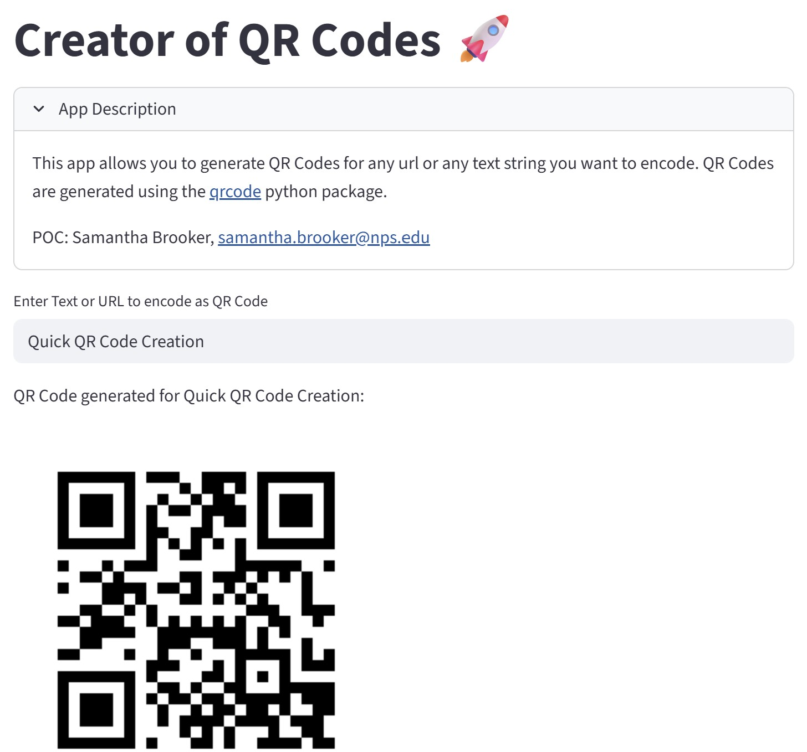

# Samantha Brooker

### US Air Force Medical Service Corp Officer

  **Interested In:** Data Analysis, AI/ML, Data Visualization, Decision Support Tools

  **Skills:** Python Data Analysis Ecosystem, Leading Developor Teams, Project Management

## Contact Me:

- **Email:** samantha.brooker@nps.edu
- **LinkedIn:** https://www.linkedin.com/in/sjbrooker/

## Current Role:
**Student:**
Naval Postgraduate School
(June 2025 - present)
- Masters of Science in Operations Research
- Expected Graduation June 2027

## Project

Streamlit App for Generating QR Codes

[Git repo](https://github.com/brookersjb/py_creator_qrcode)

Streamlit dashboard to demonstrate proof of concept. Features custom QR Code creation functionality.

Live app:

